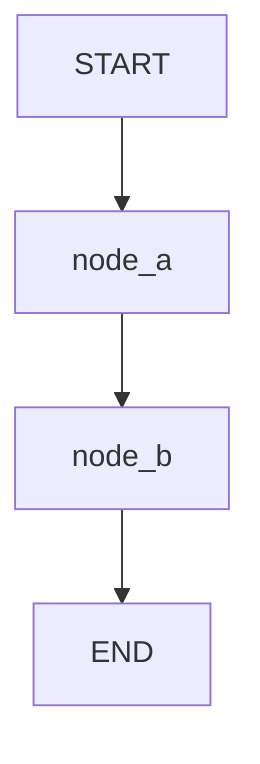

# Design: <Feature Name>

**Status:** Draft | In Review | Accepted
**Author:** Mario Aguilera / Architect Agent
**Created:** YYYY-MM-DD
**Requirements:** `specs/<feature>/requirements.md`

---

## Overview

One paragraph: what this feature is, where it lives in the system, and the key technical approach.

---

## Architecture

Which of the 6 stack layers this touches:

| Layer | Affected? | Notes |
|---|---|---|
| L1 Frontend & Delivery | Yes/No | |
| L2 Backend & Agentic Runtime | Yes/No | |
| L3 Kubernetes & Scaling | Yes/No | |
| L4 Security & Auth | Yes/No | |
| L5 Data, Memory & Storage | Yes/No | |
| L6 Observability & DevOps | Yes/No | |

Diagram (ASCII or Mermaid) if helpful:

```
[User] → [Cloudflare Workers] → [FastAPI on DOKS] → [Supabase]
```

---

## Agent Graph Topology

<!-- Delete this section if this feature has no LangGraph agents (L2 agent = No). -->

**State schema:**

```python
# e.g., TypedDict with Annotated reducers
class AgentState(TypedDict):
    messages: Annotated[list[AnyMessage], add_messages]
    # add feature-specific fields here
```

**Nodes and edges:**

| Node | Type | Responsibility |
|---|---|---|
| `[node_name]` | Function / ToolNode / LLM | [what it does] |

**Graph flow (Mermaid):**



<!-- Describe entry condition (what triggers the graph), terminal condition (what ends it), and any conditional edges. e.g., route_after_llm returns "tools" if tool_calls present, otherwise "__end__". -->

---

## Project Structure

Directory layout for code this feature introduces. For the first feature (MVP), this becomes the project skeleton — Task T1 scaffolds it.

```
<!-- e.g., Python backend:
src/
  main.py
  api/
    <domain>/
      router.py
      schemas.py
      service.py
  agents/
  db/
  core/
tests/
  unit/
  integration/
  evals/

Full-stack (Python + Next.js):
src/                   # Python backend
app/                   # Next.js App Router
  (auth)/
  (app)/
    <feature>/
      page.tsx
  components/
  lib/
tests/
-->
```

---

## Components

New or modified files and their responsibility:

| File | New/Modified | Responsibility |
|---|---|---|
| `src/...` | New | |
| `tests/...` | New | |

---

## Data Model

Schema additions or changes. Include full Supabase migration SQL.

```sql
-- Migration: <feature>
CREATE TABLE ...;
ALTER TABLE ...;
```

RLS policies required:

```sql
CREATE POLICY ...
```

---

## API / Interfaces

### HTTP Endpoints (if applicable)

```
POST /api/<resource>
  Body: { ... }
  Response: { ... }
  Auth: JWT required
```

### Agent Tool Schema (if applicable)

```python
class ToolInput(BaseModel):
    ...
```

### Internal Contracts

Key function or class interfaces that other components will depend on.

---

## Middleware & Cross-Cutting Concerns

<!-- Delete this section if this feature introduces no middleware or cross-cutting behavior. -->

| Concern | Implementation | Applies To | New/Existing |
|---|---|---|---|
| CORS | [e.g., CORSMiddleware, explicit origins] | All routes | Existing |
| Authentication | [e.g., JWT via Supabase, extracted in dependency] | Protected routes | Existing/New |
| Request ID | [e.g., UUID injected in middleware, propagated to logs] | All routes | New |
| Rate limiting | [e.g., Cloudflare WAF rules / token-bucket in middleware] | Public endpoints | Existing/New |
| Logging | [e.g., structlog bound with request_id per request] | All routes | Existing |

---

## Error Handling

<!-- Delete this section if this feature introduces no new error categories. -->

| Error Category | HTTP Status | Error Code | Response Shape | Recovery |
|---|---|---|---|---|
| Validation error | 422 | `VALIDATION_ERROR` | `{"error": {"code", "message", "details": [field errors]}}` | Client fixes input |
| Auth error | 401 | `UNAUTHORIZED` | `{"error": {"code", "message"}}` | Re-authenticate |
| Not found | 404 | `NOT_FOUND` | `{"error": {"code", "message"}}` | Client checks ID |
| LLM timeout | 504 | `LLM_TIMEOUT` | `{"error": {"code", "message"}}` | Retry with backoff |
| Internal error | 500 | `INTERNAL_ERROR` | `{"error": {"code", "message"}}` | Log + alert |

All error responses share the same envelope: `{"error": {"code": str, "message": str, "details": any}}`. Never expose stack traces or internal state to the client.

---

## Security Considerations

- Auth: [how authentication and authorization work for this feature]
- Input validation: [what user inputs exist and how they are validated]
- Prompt injection: [if LLM calls are involved, how injection is mitigated]
- Secrets: [what secrets are needed and how they are stored]
- RLS: [Supabase row-level security rules required]

---

## Testing Strategy

| Test Type | What | Where |
|---|---|---|
| Unit | [what] | `tests/unit/` |
| Integration | [what] | `tests/integration/` |
| Agent eval | [what] | `tests/evals/` |
| E2E | [what] | `tests/e2e/` |

---

## UI Design

<!-- Delete this section if this feature has no frontend (L1 = No). -->

### Pages / Routes

| Route | Page | Purpose |
|---|---|---|
| `/` | [page name] | [purpose] |
| `/<feature>` | [page name] | [purpose] |

### Component Hierarchy

```
<!-- Tree diagram. Mark Server vs Client components.
e.g.:
<FeaturePage> (Server)
  <FeatureLayout> (Server)
    <ChatContainer> (Client — uses useChat)
      <MessageList> (Client)
        <MessageBubble> (Client)
      <TypingIndicator> (Client)
      <ChatInput> (Client)
-->
```

### Interaction States

All data-dependent components implement these four states:

| Component | Loading | Error | Empty | Success |
|---|---|---|---|---|
| [component] | [e.g., skeleton matching layout] | [e.g., inline error + retry] | [e.g., empty state prompt] | [e.g., rendered content] |

For streaming components (AI responses): use `isLoading` from `useChat` to show a typing indicator. Streaming text renders incrementally — do not wait for completion before displaying.

### Streaming UI Pattern

<!-- Describe how LLM responses render in the UI.
e.g., AI SDK v6: Server Action calls streamText() → toDataStream(). Client uses useChat({ api: serverAction }). UIMessage[] is authoritative state. Assistant messages render as they stream — partial content displayed immediately. TypingIndicator shown while isLoading=true and no assistant content yet. Stream can be cancelled via stop() on Escape keypress. -->

### Responsive Behavior

| Breakpoint | Layout Changes |
|---|---|
| base (< 640px) | [e.g., single column, nav collapses to drawer] |
| sm (640px) | [e.g., sidebar appears] |
| md (768px) | [e.g., main content widens] |
| lg (1024px) | [e.g., full desktop layout] |
| xl (1280px) | [e.g., max-width container, centered] |

### Accessibility Requirements

WCAG 2.1 AA compliance required. Feature-specific requirements:

| Element | Requirement |
|---|---|
| Chat message container | `role="log"` `aria-live="polite"` `aria-atomic="false"` |
| Streaming text container | `aria-live="polite"` `aria-atomic="false"` |
| Loading / status messages | `role="status"` |
| Send button | Accessible label, keyboard-activated |
| Input field | `aria-label` or `<label>` associated |
| Keyboard shortcuts | Enter=send, Shift+Enter=newline, Escape=cancel stream |
| Color contrast | Min 4.5:1 normal text, 3:1 large text (18px+) |
| Focus management | Focus returns to input after send; modals trap focus |

---

## Observability

What metrics, traces, and log events does this feature need?

| Type | What to Instrument | Tool |
|---|---|---|
| Metrics | [e.g., request latency, error rate, token usage] | Prometheus / OpenTelemetry |
| Traces | [e.g., full request path, agent tool call chain, LLM inference] | OpenTelemetry / LangSmith |
| Logs | [e.g., ingestion pipeline steps, auth events, errors] | structlog (JSON) with trace_id |
| Dashboards | [e.g., Grafana board for API latency and error rates] | Grafana |

---

## Deployment

| Aspect | Detail |
|---|---|
| Strategy | [Rolling update / Blue-green / Canary] |
| Health endpoints | `/healthz` (liveness), `/ready` (readiness) |
| Startup time | [Estimated seconds — affects startup probe config] |
| Resource requirements | [CPU/memory requests and limits] |
| Rollback plan | [`kubectl rollout undo` / git-revert manifest] |

---

## Infrastructure Changes

New infrastructure required for this feature:

| Resource | Type | Details |
|---|---|---|
| [e.g., K8s Deployment] | [New / Modified] | [Description] |
| [e.g., DNS record] | [New] | [api.xchains.dev → LoadBalancer IP] |
| [e.g., Supabase table] | [New] | [documents table with RLS] |

---

## Open Questions

Questions that arose during design and are not yet resolved:

- [ ] Q1: [question] — impacts [component]
- [ ] Q2: [question] — impacts [component]

---

## Decisions Made

Significant decisions and their rationale:

| Decision | Alternatives Considered | Rationale |
|---|---|---|
| Use X instead of Y | Y, Z | [reason] |
